# POO_proyect2

Proyecto de la materia POO. Modelamiento de un arepuerto con interza para usuario basado en el patron modelo controlador vista (MVC)

## Tabla de Contenidos

1. [Requisitos](#requisitos)
2. [Instalación](#instalación)
3. [Funcionalidades](#funcionalidades)

## Requisitos

- Python 3.10.5
- streamlit 1.28.0
- virtualenv 20.23.1

## Instalación

1. Clona el repositorio:
    git clone git@github.com:jucollas/POO_proyect2.git
2. Crea y activa un entorno virtual en el directorio del proyecto (opcional pero recomendado):
    python -m venv venv
    . env\Scripts\activate
3. Instala las dependencias:
    pip install -r requirements.txt
4. Corre el proyecto:
    streamlit run inicio.py

## Funcionalidades

### Interfaz de Usuario

1. **Registrarse:** Los usuarios deben resgitarse para poder compara un vuelo.
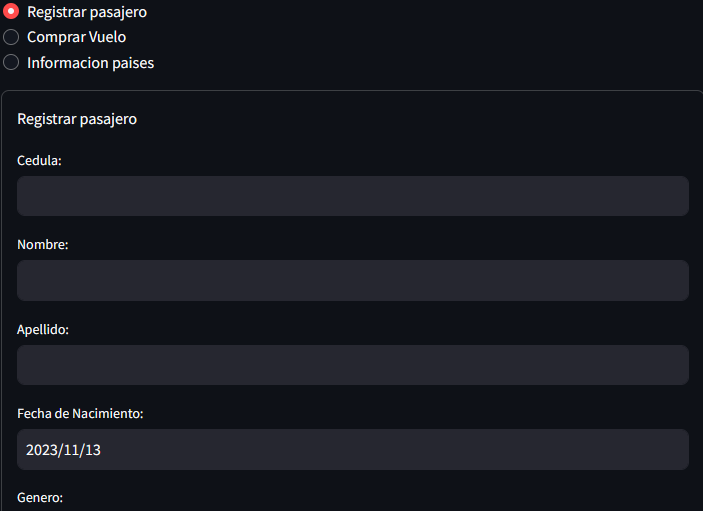

2. **Comparar Vuelos:** Permite a los usuarios buscar y comparar información sobre vuelos disponibles.
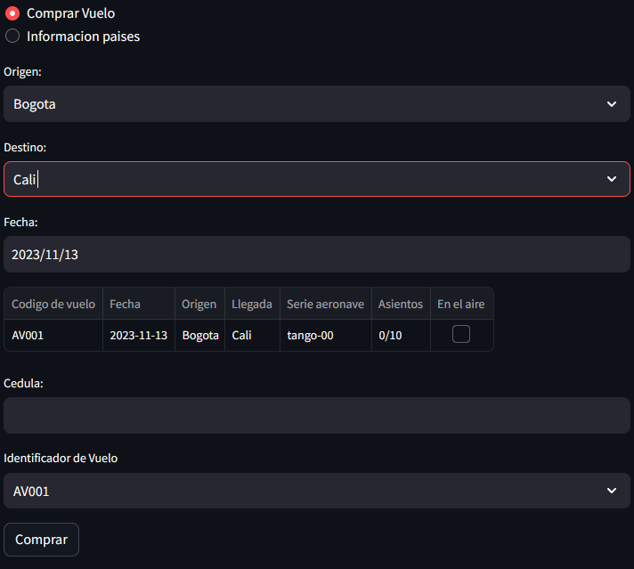

3. **Información de Países:** Proporciona datos detallados sobre diferentes países, relevantes para los usuarios.
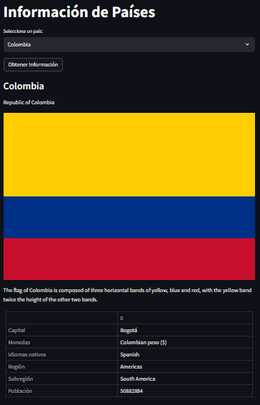
Es necesario proporcionar la cedula anteriormente ya registrada en el sistema con el formulario anterior y seleccionar el codigo el vuelo que desear comprar.

### Interfaz de Administrador

1. **Gestión de Aeronaves:**
   - Crear: Agregar nuevas aeronaves al sistema.
   - Eliminar: Retirar aeronaves del sistema.
   - Mantenimiento: Marcar aeronaves para mantenimiento.
   - Información Detallada: Obtener detalles específicos de una aeronave.

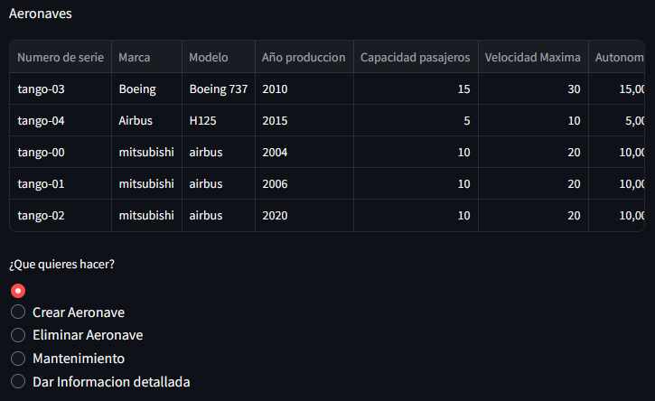

2. **Gestión de Vuelos:**
   - **Aerolíneas:**
     - Iniciar Vuelo: comenzar vuelos (Los conecta a la torre de control de su punto de origen).
     - Cancelar Vuelo: Anular vuelos programados.
     - Crear Vuelo: Programar vuelos
   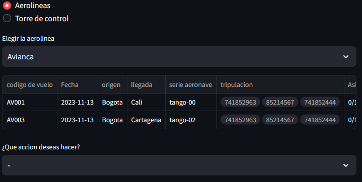

   - **Torre de Control:**
     - Despegar: Autorizar despegues de aeronaves.
     - Aterrizar: Permitir aterrizajes en el aeropuerto.
     - Terminar: Concluir vuelos exitosos.
     - Continuar: conecta los vuelso a la torre de control de su punto destino
   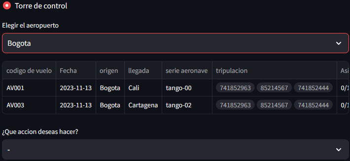

     - Solicitar Reporte de Ubicación: Obtener informes de ubicación de vuelos.
   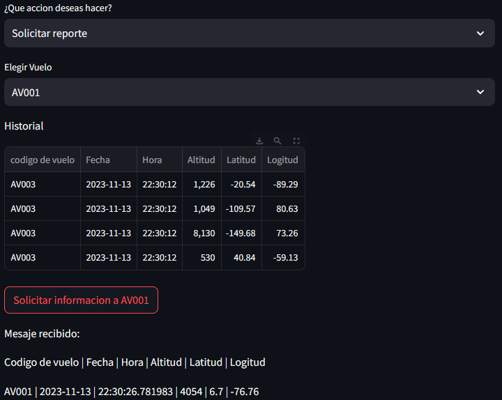
   

3. **Gestión de Puertas de Abordaje:**
   - Crear: Agregar nuevas puertas de abordaje.
   - Borrar: Eliminar puertas de abordaje existentes.
   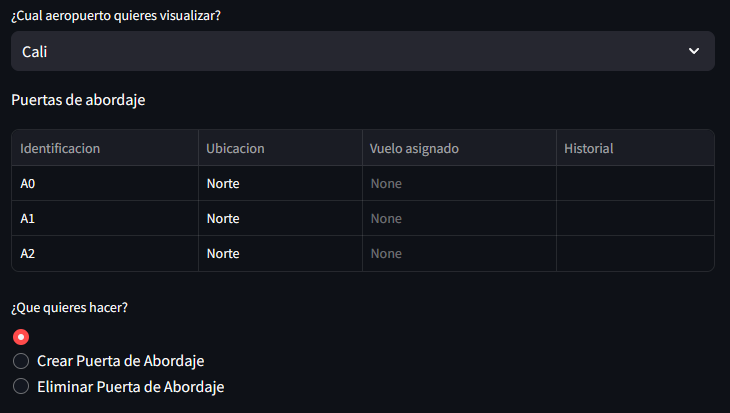

4. **Gestión de Tripulación:**
   - Crear: Agregar nuevos miembros de tripulación.
   - Borrar: Eliminar miembros de tripulación.
   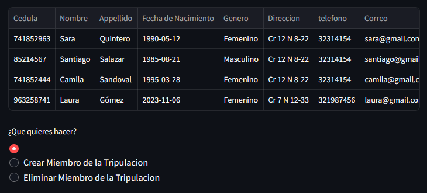

5. **Gestión de Aerolíneas:**
   - Crear: Registrar nuevas aerolíneas en el sistema.
   - Borrar: Eliminar aerolíneas existentes.
   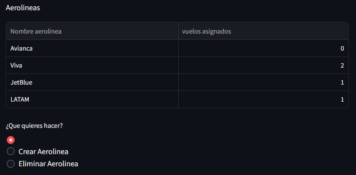

6. **Gestión de Aeropuertos:**
   - Crear: Añadir nuevos aeropuertos.
   - Borrar: Eliminar aeropuertos existentes.
   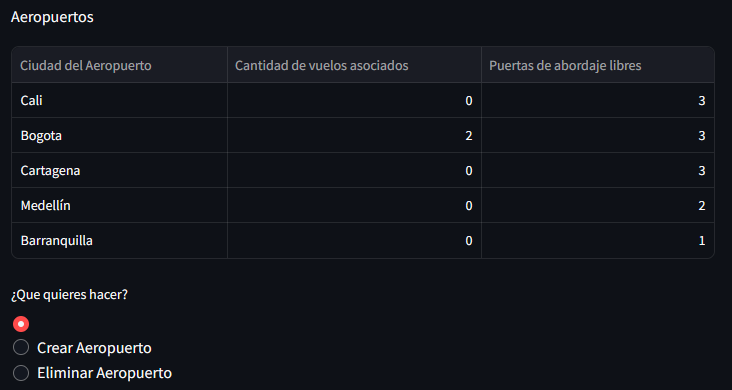

7. **Gestionar Pasajeros:**
   - Visualizar Todos los Pasajeros Registrados: Obtener una lista de todos los pasajeros registrados.
   - Borrar: Eliminar registros de pasajeros.
   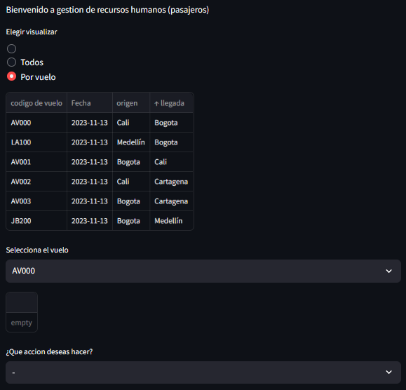
